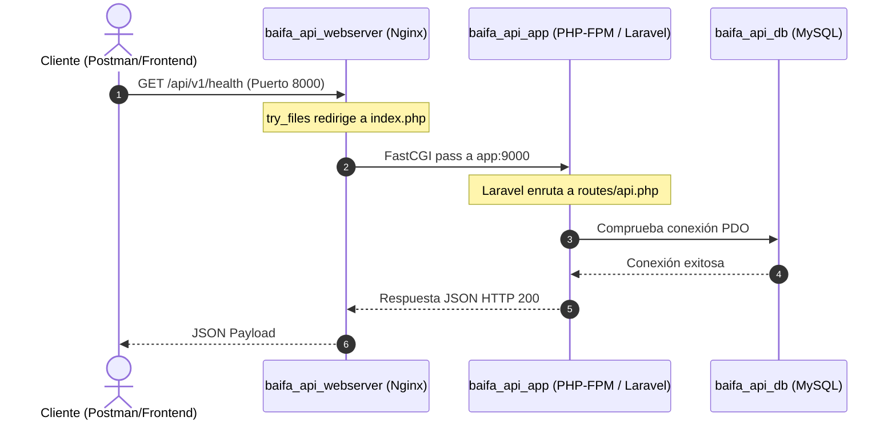

# Arquitectura del Sistema - baifa-api

Este documento detalla el diseño de arquitectura, la interacción entre servicios, la persistencia de datos y el ciclo de vida de las solicitudes en **baifa-api**.

---

## 1. Topología de Servicios (Docker Compose)

El proyecto utiliza tres servicios independientes dentro de una red interna bridge llamada `baifa_network`:

| Contenedor | Servicio | Imagen Base | Función | Puertos |
| :--- | :--- | :--- | :--- | :--- |
| `baifa_api_webserver` | `webserver` | `nginx:alpine` | Reverse Proxy / Web Server. Resuelve archivos estáticos y delega peticiones PHP a FastCGI. | `8000:80` |
| `baifa_api_app` | `app` | Personalizada (`Dockerfile` en `docker/php/`) basada en `php:8.4-fpm` | Procesamiento de la lógica de negocio Laravel, Artisan y Composer. | `9000` (interno) |
| `baifa_api_db` | `db` | `mysql:8.0` | Almacenamiento relacional persistente en el volumen `baifa_api_dbdata`. | `3306:3306` |

---

## 2. Flujo de una Solicitud HTTP

---

## 3. Persistencia de Datos

1. **Código fuente:** Montado en tiempo real desde el sistema anfitrión a través del volumen `.:/var/www`. Cualquier cambio en el código se refleja inmediatamente sin reconstruir imágenes.
2. **Base de datos:** Se utiliza un volumen gestionado por Docker (`baifa_api_dbdata`) mapeado a `/var/lib/mysql`. Los datos no se pierden al reiniciar o detener contenedores (`docker compose down`).

---

## 4. Estándares de Diseño de la API

* **Prefijo de versión:** Todas las rutas públicas de la API deben comenzar con `/api/v1/`.
* **Estructura de Respuestas:** Respuestas JSON consistentes con encabezado `Content-Type: application/json`.
* **Manejo de Excepciones:** Configurado en `bootstrap/app.php` para retornar siempre JSON cuando el request sea a `/api/*`.